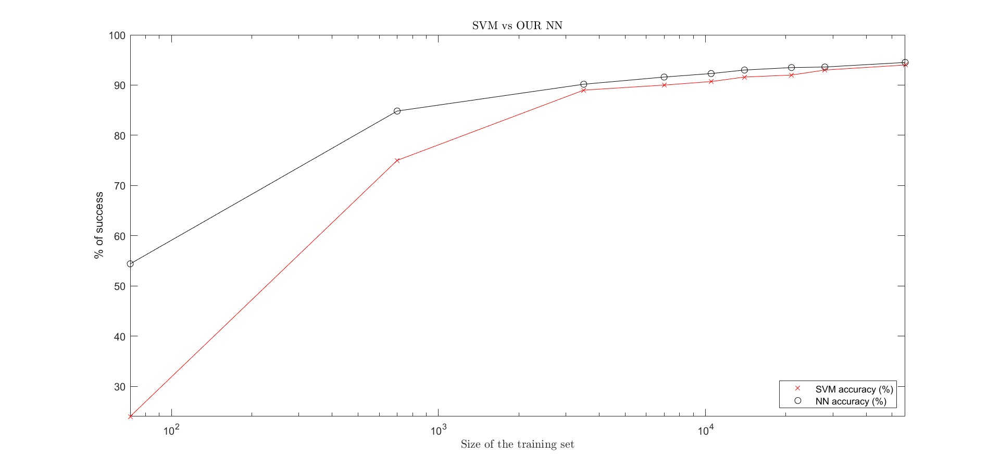

# Building-a-Neural-Network-from-scatch
This repository presents the code and design of a fully connected neural network (NN) created from scratch, which bases its learning in the Stochastic Gradient Descent method (SGD). The net was designed to be selfconsistent, and it relies only in the libraries NumPy and random. The user can easily input the desired number of layers together with the number of neurons per layer, which can be different for each layer.

Moreover, the NN has been succesfully trained and used to predict handwritten digits from the MNIST dataset, and it could potentially be used for many other purposes only by changing the number of neurons in the first and last layers. (More details on the section "Comments on use")

Note that for more complex problems one should probably reconsider the architechture of the network and use a more sophisticated design such as a convolutional network, or even a combination of both a fully connected NN and a convolutional one.

## Convergence analysis
To ilustrate the functioning of the net, we present a comparaison of its accuracy vs the accuracy obtained with SVM, for different sizes of the training set. The NN performs much better than SVM when the size of the dataset is small.

## Comments on use
A) Use the network and train it with MNIST:

Download the two Python files that can be found inside the folder named "our_NN". The NN.py file contains all the functions required for the network to work, such as the SGD algorithm, the feedforward function, the cost functions, the routine in charge of backpropagation etc. The run.py file is the one to be executed. It calls the NN, initializes the weights and biases and starts the learing process. 

B) Use the NN with a different dataset:

If we want to use the NN to learn from a different dataset, we have to follow the next schematic steps:

i) Modify the run.py file to load the desired dataset.

ii) When calling the NN on the run.py file, remember that the number of neurons on the first and last layer of the NN must agree with the features of the training data. As an ilustrative example, to train the NN with the MNIST dataset we must keep in mind that the images have (28x28)=784 pixels, meaning that the first layer should have 784 neurons. Next, concerning the last layer, if we want to predict numbers from 0 to 9, it is a natural choice to set the number of neurons to be equal to 10, so that each neuron is associated with one possible output. 
